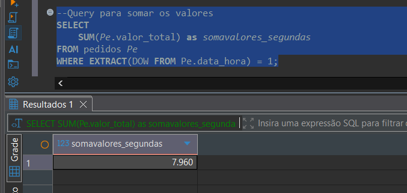
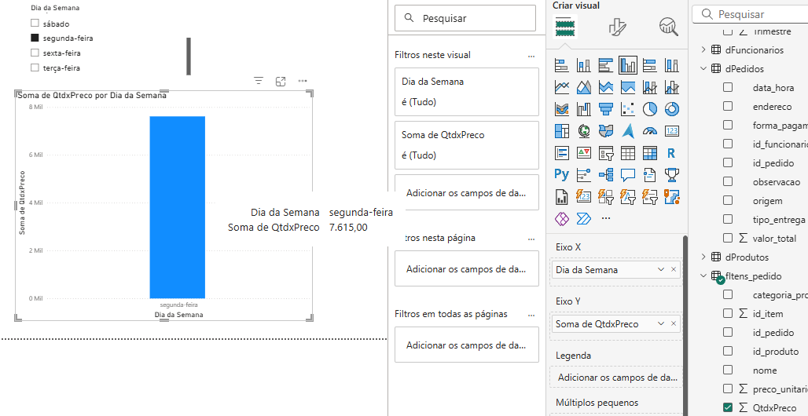
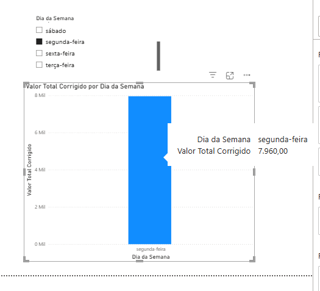

# 📊 Problemas Enfrentados no Desenvolvimento do Dashboard da Lanchonete

Este documento descreve alguns **desafios e soluções** encontradas durante o desenvolvimento do dashboard da Lanchonete no **Power BI**, integrado a um banco de dados **PostgreSQL**.

---

## 🗓️ Ajuste da Tabela Calendário

Como de costume, a tabela calendário foi criada manualmente no Power Query, através de uma **consulta nula** e posterior inserção do código M no editor avançado.

### Código inicial:
```m
    let
    DataMin = List.Min(dPedidos[data_hora]),
    DataMax = List.Max(dPedidos[data_hora]),
    QtdDias = Duration.Days(DataMax-DataMin)+1,
    Personalizar1 = List.Dates(DataMin, QtdDias, #duration(1, 0, 0, 0)),
    #"Convertido para Tabela" = Table.FromList(Personalizar1, Splitter.SplitByNothing(), null, null, ExtraValues.Error),
    #"Colunas Renomeadas" = Table.RenameColumns(#"Convertido para Tabela",{{"Column1", "Datas"}}),
    #"Tipo Alterado" = Table.TransformColumnTypes(#"Colunas Renomeadas",{{"Datas", type date}}),
    #"Ano Inserido" = Table.AddColumn(#"Tipo Alterado", "Ano", each Date.Year([Datas]), Int64.Type),
    #"Mês Inserido" = Table.AddColumn(#"Ano Inserido", "Mês", each Date.Month([Datas]), Int64.Type),
    #"Nome do Mês Inserido" = Table.AddColumn(#"Mês Inserido", "Nome do Mês", each Date.MonthName([Datas]), type text),
    #"Início do Mês Inserido" = Table.AddColumn(#"Nome do Mês Inserido", "Início do Mês", each Date.StartOfMonth([Datas]), type date),
    #"Trimestre Inserido" = Table.AddColumn(#"Início do Mês Inserido", "Trimestre", each Date.QuarterOfYear([Datas]), Int64.Type),
    #"Semana do Ano Inserida" = Table.AddColumn(#"Trimestre Inserido", "Semana do Ano", each Date.WeekOfYear([Datas]), Int64.Type),
    ColunaSemestre = Table.AddColumn(#"Semana do Ano Inserida", "Semestre", each if [Mês] <= 6 then "Semestre 1" else "Semestre 2"),
    #"Dia da Semana Inserido" = Table.AddColumn(ColunaSemestre, "Dia da Semana", each Date.DayOfWeekName([Datas])),
    #"Coluna Condicional Adicionada" = Table.AddColumn(#"Dia da Semana Inserido", "Fim de Semana/Dia útil", each if [Dia da Semana] = 0 then "Fim de Semana" else if [Dia da Semana] = 6 then "Fim de Semana" else "Dia de Semana"),
    #"Tipo AlteradoSemestre" = Table.TransformColumnTypes(#"Coluna Condicional Adicionada",{{"Semestre", type text}, {"Fim de Semana/Dia útil", type text}})
in
    #"Tipo AlteradoSemestre"
```

#### Problema:
Date.DayOfWeek([Datas])
Essa fórmula retorna valores de 0 a 6, onde 0 representa domingo, seguindo o mesmo padrão do PostgreSQL.
Apesar de funcional, o resultado não era muito intuitivo para fins visuais dentro do Power BI.


#### Ajuste aplicado:
Date.DayOfWeekName([Datas])

Com isso, a coluna passou a exibir os nomes dos dias da semana ("domingo", "segunda", etc.), tornando a análise mais semântica e legível nos filtros e gráficos.


#### 💸 Correção da Taxa de Entrega

Foi identificado que a taxa de entrega (R$5,00) estava armazenada apenas na tabela pedidos, e não refletia automaticamente na tabela de detalhamento itens_pedido.

Para validar a consistência dos valores, foi utilizada a seguinte query SQL no PostgreSQL:

```sql
SELECT 
  SUM(Pe.valor_total) as somavalores_segundas
FROM pedidos Pe
WHERE EXTRACT(DOW FROM Pe.data_hora) = 1;
```
  

🧩 Função EXTRACT(DOW ...)

A função EXTRACT(DOW FROM coluna_data) é muito útil para análises temporais.
Ela extrai o número do dia da semana (0 a 6) diretamente a partir de uma data, permitindo agrupamentos e comparações.
No exemplo acima, 1 representa segunda-feira.

🎯 Criação da Medida DAX de Correção

Para resolver o problema da taxa de entrega no Power BI, foi criada a seguinte medida DAX:

``` Dax
Valor Total Corrigido = 
VAR SomaItens = SUMX(
    'fItens_pedido',
    'fItens_pedido'[quantidade] * 'fItens_pedido'[preco_unitario]
)
VAR SomaTaxa =
SUMX(
    VALUES('fItens_pedido'[id_pedido]),    -- percorre cada pedido distinto
    IF(
        LOOKUPVALUE('dPedidos'[tipo_entrega], 'dPedidos'[id_pedido], 'fItens_pedido'[id_pedido]) = "ENTREGA",
        5,
        0
    )
)
RETURN
SomaItens + SomaTaxa
```

🔍 Importância do LOOKUPVALUE()

A função LOOKUPVALUE() foi essencial para a correção.
Ela permitiu buscar o tipo de entrega (BALCÃO ou ENTREGA) na tabela dPedidos dentro do contexto da tabela fato fItens_pedido.
Dessa forma, o cálculo adiciona os R$5,00 apenas quando o tipo de entrega é "ENTREGA", sem duplicações.


#### COMPARATIVO

Antes da correção:


Depois da Correção:



💡 Conclusão e Aprendizado

O principal aprendizado deste ajuste foi reforçar que uma boa modelagem de dados é o alicerce de qualquer análise confiável.

Antes de criar DAX complexos, é fundamental garantir:

    -> Relacionamentos corretos entre tabelas;
    -> Cardinalidades bem definidas;
    -> Colunas de data e chaves bem estruturadas.

Isso reduz erros silenciosos e torna as medidas muito mais limpas, performáticas e fáceis de manter.

🔗 Relacionado


